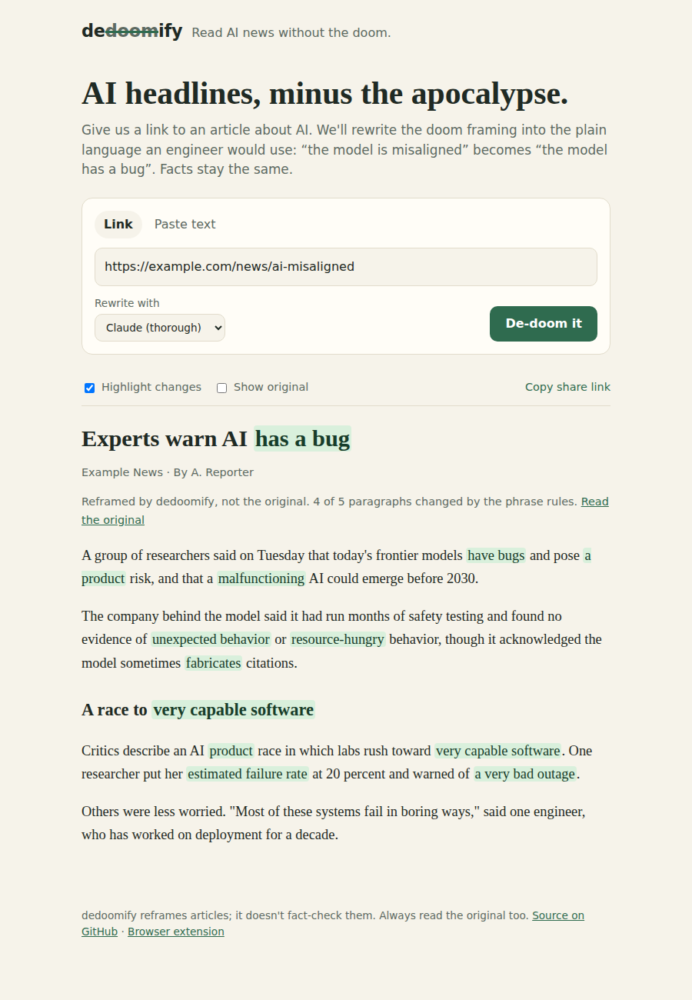

# dedoomify

**Read AI news without the doom.** Paste a link to an article about AI and
[dedoomify.com](https://dedoomify.com) rewrites the doom framing into the plain
language an engineer would use about software with defects:

| Before | After |
| --- | --- |
| The model **is misaligned** | The model **has a bug** |
| AI poses **an existential risk** | AI poses **a product risk** |
| A **rogue AI** could emerge | A **malfunctioning AI** could emerge |
| Labs are racing toward **superintelligence** | Labs are racing toward **very capable software** |
| What's your **p(doom)**? | What's your **estimated failure rate**? |

Facts, names and numbers stay the same; only the framing changes. Every change
is highlighted, and you can show the original next to each paragraph.



## How it works

```
browser ──► /api/dedoom?url=… ──► fetch page ──► extract article ──► rewrite ──► JSON
                                   (public hosts   (Readability)     Claude, or the
                                    only)                            phrase rules
```

- **`public/`** is the static site: `index.html`, `app.js`, `styles.css`, and
  `diff.js`, which highlights what changed in each paragraph.
- **`api/dedoom.js`** is one serverless function. `GET ?url=` fetches and
  rewrites an article (responses are cacheable at the CDN for a day, so a
  popular link costs one rewrite); `POST {text}` rewrites pasted text.
- **`lib/fetch-article.js`** fetches the page, refusing private and internal
  addresses (including on redirects), with size and time limits, and extracts
  the article with Mozilla Readability.
- **`lib/llm.js`** asks Claude to rewrite the paragraphs when
  `ANTHROPIC_API_KEY` is set. If Claude isn't configured or fails, the site
  falls back to the phrase rules, and says so on the page.
- **`shared/dedoom-core.js`** holds the phrase rules. The same file powers the
  API fallback and the browser extension. Add or tune rules there.
- **`extension/`** is a Manifest V3 browser extension that rewrites the page
  you're reading, using the phrase rules only.

## Run it locally

Needs Node 20 or newer.

```sh
npm install
npm test
npm run dev            # http://localhost:3000
```

Without an API key the site uses the phrase rules. To try the Claude rewrite:

```sh
ANTHROPIC_API_KEY=sk-ant-... npm run dev
```

| Variable | Default | Purpose |
| --- | --- | --- |
| `ANTHROPIC_API_KEY` | unset | Turns on the Claude rewrite. |
| `DEDOOMIFY_MODEL` | `claude-opus-5-5` | Which Claude model rewrites articles. |
| `DEDOOMIFY_LLM` | on | Set to `off` to use the rules only without removing the key. |

## Deploy to dedoomify.com (Vercel)

The repo deploys to Vercel as is: static files from `public/` and the function
in `api/`. No build step.

1. Sign in at [vercel.com](https://vercel.com) with GitHub and choose
   **Add New → Project**, then import `akspad/dedoomify`. Leave the framework
   preset as **Other** and the build command empty.
2. Under **Settings → Environment Variables**, add `ANTHROPIC_API_KEY` (from
   [console.anthropic.com](https://console.anthropic.com)). Set a monthly spend
   limit on that key in the Anthropic Console, since the site is public.
3. Deploy. You'll get a `*.vercel.app` URL to check.
4. Under **Settings → Domains**, add `dedoomify.com` and `www.dedoomify.com`.
   Vercel shows the DNS records to create at your registrar. Usually that's an
   `A` record for `@` pointing to Vercel's IP and a `CNAME` for `www` pointing
   to Vercel, or you can switch the domain's nameservers to Vercel. Use the
   exact values Vercel shows. HTTPS is issued automatically once DNS resolves.

Every push to `main` then deploys to production, and every pull request gets
a preview URL.

## Browser extension

The extension rewrites the page you're on, in place, when you click its
button. It needs no API key and sends nothing anywhere; it asks only for
`activeTab` and `scripting`, so it can touch a page only after you click.

To try it in Chrome, Edge or Brave:

1. Run `npm run build:extension` (copies the latest rules into `extension/`).
2. Open `chrome://extensions`, turn on **Developer mode**, click
   **Load unpacked**, and pick the `extension/` folder.
3. Open an article about AI and click the dedoomify button.

To publish it, zip the `extension/` folder and upload it to the
[Chrome Web Store developer dashboard](https://chrome.google.com/webstore/devconsole)
(one-time $5 registration fee).

## Contributing

Rule ideas are the easiest contribution: add a phrase pair to
`shared/dedoom-core.js`, add a test case in `test/rules.test.js`, run
`npm run build:extension && npm test`, and open a pull request. Put longer
phrases before shorter ones they contain, and handle `a`/`an` when a
replacement changes the article.

dedoomify reframes articles; it doesn't fact-check them. Always read the
original too.

## License

MIT
