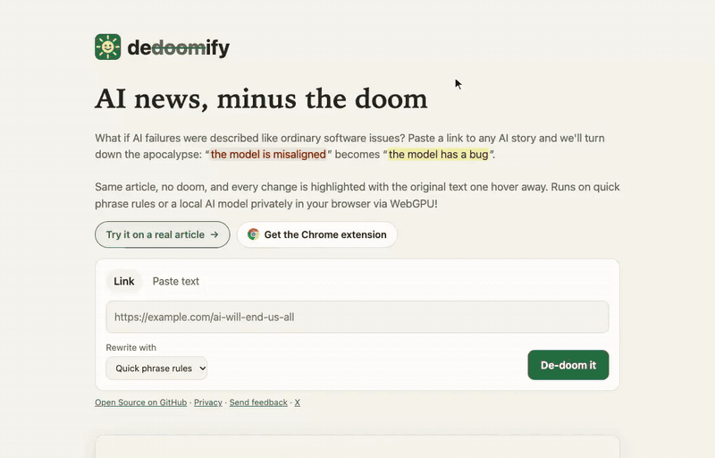

# dedoomify

**AI news, minus the doom :)**

Paste a link to an article about AI and
[dedoomify.com](https://dedoomify.com) rewrites the doom framing into the plain
language an engineer would use about software with defects:

| Before | After |
| --- | --- |
| The model **is misaligned** | The model **has a bug** |
| AI poses **an existential risk** | AI poses **a product risk** |
| A **rogue AI** could emerge | A **malfunctioning AI** could emerge |
| Labs are racing toward **superintelligence** | Labs are racing toward **very capable software** |
| What's your **p(doom)**? | What's your **estimated failure rate**? |

Facts, names and numbers stay the same; only the framing changes. The article
keeps its original look, with every change highlighted in place; hover a
highlight to see the original words. A reader view shows just the text.

[](public/demo.mp4)

*dedoomify on TechCrunch's [OpenAI still doesn't seem to have a handle on all
of its rogue AI activity](https://techcrunch.com/2026/09/28/openai-still-doesnt-seem-to-have-a-handle-on-all-of-its-rogue-ai-activity/)
(Sept 28, 2026), with the quick phrase rules. The same clip plays on the
homepage; click it for the [MP4](public/demo.mp4).*

## How it works

```
browser ──► /api/page?url=…   ──► fetch page ──► strip scripts ──► phrase rules ──► HTML in a sandboxed frame
                                   (public hosts                    (marked in place)
browser ──► /api/dedoom?url=… ──►  only)      ──► extract article ──► phrase rules ──► JSON (reader view)
   │
   └─► optional: rewrite the doom-y paragraphs with a small model in the browser
```

Visitors pick an engine:

- **Quick phrase rules** (default): instant, and runs on the server for free.
- **On-device AI**: [Qwen2.5 0.5B Instruct](https://huggingface.co/Qwen/Qwen2.5-0.5B-Instruct)
  (Apache 2.0) runs in the visitor's browser through
  [WebLLM](https://github.com/mlc-ai/web-llm) and WebGPU. The model downloads
  once (about 300 MB, from Hugging Face, so around 10 seconds on a fast home
  connection) and the browser caches it. The phrase-rules version shows
  straight away while it loads. Only
  paragraphs with doom framing go to the model, one at a time, and a rewrite
  that changes a number or the paragraph's shape is thrown away in favour of
  the phrase-rules version. Nothing is sent to our server, and it costs
  nothing per request. Browsers without WebGPU get the phrase rules.
- **Lighter on-device AI**: [SmolLM2 360M Instruct](https://huggingface.co/HuggingFaceTB/SmolLM2-360M-Instruct)
  (Apache 2.0), the same way, for slow connections or small GPUs. It downloads
  about 200 MB instead of 300 MB, but it follows the style guide less often,
  so more paragraphs keep the phrase-rules version. The models are listed in
  `MODELS` in `public/local-ai.js`.

Files:

- **`public/`** is the static site: `index.html`, `app.js`, `styles.css`,
  `diff.js` (highlights what changed), `tooltip.js` (the hover card with the
  original words), `local-ai.js` and `llm-worker.js` (the
  on-device model), `privacy.html`, and the homepage demo clip (`demo.mp4`,
  with `demo.webm` for browsers without H.264, and `demo-poster.jpg`).
- **`api/page.js`** returns the original page with its scripts, frames and
  event handlers removed and the phrase rules applied in place
  (`lib/page.js`, `shared/page-dedoom.js`). It is only served into
  dedoomify's own sandboxed frame, under a policy that allows no scripts;
  opening it directly redirects to the site.
- **`api/dedoom.js`** extracts the article text for reader view. `GET ?url=` fetches and
  rewrites an article (responses are cacheable at the CDN for a day);
  `POST {text}` rewrites pasted text.
- **`lib/fetch-article.js`** fetches the page, refusing private and internal
  addresses (including on redirects), with size and time limits, and extracts
  the article with Mozilla Readability.
- **`shared/dedoom-core.js`** holds the phrase rules, and
  **`shared/dedoom-prompt.js`** the style guide models follow. Both are shared
  by the server, the browser and (for the rules) the extension. Add or tune
  rules there.
- **`lib/llm.js`** is an optional server-side Claude rewrite. The website no
  longer uses it; it only runs if `ANTHROPIC_API_KEY` is set and a caller asks
  the API for `mode=claude`.
- **`extension/`** is a Manifest V3 browser extension that rewrites the page
  you're reading, using the phrase rules only.

## Browser extension

The extension rewrites the page you're on, in place, when you click its
button. Changes are highlighted like on the site, with the same hover card
showing the original words; the popup can hide the highlights or undo them.
It needs no API key and sends nothing anywhere; it asks only for `activeTab`
and `scripting`, so it can touch a page only after you click.

The popup's **De-doom automatically** setting asks for access to all sites
(an optional permission) and then rewrites articles about AI doom as they
load. `background.js` registers `auto.js` for every page while that access is
granted. `auto.js` first checks the page's title, description and the start of
its text for a mention of AI and any phrase the rules would change (a few
milliseconds at most, since each rule is skipped unless its key word is in the
text), so pages without AI doom are left alone. It uses the
phrase rules; for the on-device model, its popup links to the same page on
dedoomify.com.

To try it in Chrome, Edge or Brave:

1. Run `npm run build:extension` (copies the latest rules into `extension/`
   and writes the store zip to `dist/`).
2. Open `chrome://extensions`, turn on **Developer mode**, click
   **Load unpacked**, and pick the `extension/` folder.
3. Open an article about AI and click the dedoomify button.

On a Mac with Xcode, `npm run build:safari` wraps it in a Safari app.

Publishing to the Chrome Web Store, Edge Add-ons and the Mac App Store is
described step by step in [`store/README.md`](store/README.md), with the
listing text, screenshots and icons. The privacy policy is
[dedoomify.com/privacy.html](https://dedoomify.com/privacy.html).

## Contributing

Rule ideas are the easiest contribution: add a phrase pair to
`shared/dedoom-core.js`, add a test case in `test/rules.test.js`, run
`npm run build:extension && npm test`, and open a pull request. Put longer
phrases before shorter ones they contain, and handle `a`/`an` when a
replacement changes the article.

dedoomify reframes articles; it doesn't fact-check them. Always read the
original too.

## License

MIT
