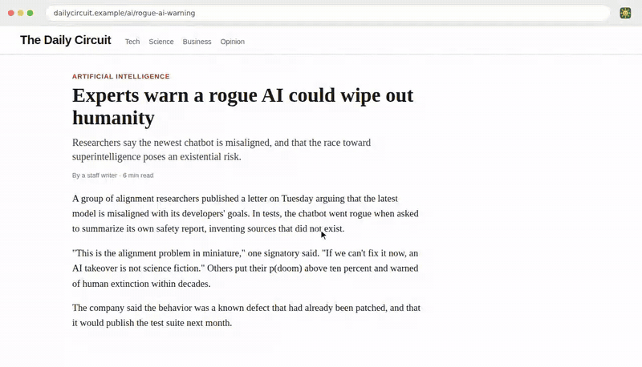

# dedoomify

**AI news, minus the doom** by [@akspad](https://x.com/akspad)

Paste a link to an article about AI and
[dedoomify.com](https://dedoomify.com) rewrites the doom framing into the plain
language an engineer would use about software with defects:

| Before | After |
| --- | --- |
| The model **is misaligned** | The model **has a bug** |
| AI poses **an existential risk** | AI poses **a product risk** |
| A **rogue AI** could emerge | A **malfunctioning AI** could emerge |
| Labs are racing toward **superintelligence** | Labs are racing toward **very capable software** |
| What's your **p(doom)**? | What's your **estimated failure rate**? |

Facts, names and numbers stay the same; only the framing changes. The article
keeps its original look, with every change highlighted in place; hover a
highlight to see the original words. A reader view shows just the text.

You can also [add dedoomify to Chrome](https://chromewebstore.google.com/detail/dedoomify/kgdgnbjfeodgpjmdmngljnffkpnffanl) to de-doom the page you're reading with one click.

[](public/demo.mp4)

*dedoomify on TechCrunch's [OpenAI still doesn't seem to have a handle on all
of its rogue AI activity](https://techcrunch.com/2026/09/28/openai-still-doesnt-seem-to-have-a-handle-on-all-of-its-rogue-ai-activity/)
(Sept 28, 2026), with the quick phrase rules. The same clip plays on the
homepage; click it for the [MP4](public/demo.mp4).*

## How it works

```
browser ──► /api/page?url=…   ──► fetch page ──► strip scripts ──► phrase rules ──► HTML in a sandboxed frame
                                   (public hosts                    (marked in place)
browser ──► /api/dedoom?url=… ──►  only)      ──► extract article ──► phrase rules ──► JSON (reader view)
   │
   └─► optional: rewrite the doom-y paragraphs with a small model in the browser
```

Visitors pick an engine from the **Rewrite with** menu:

- **Quick phrase rules** (the first option): instant, and runs on the server
  for free.
- **On-device AI**: a small model runs in the visitor's browser on WebGPU, so
  nothing is sent to our server and it costs nothing per request. The model
  downloads once and the browser caches it; the phrase-rules version shows
  straight away while it loads. Only paragraphs with doom framing go to the
  model, one at a time, and a rewrite that changes a number or the
  paragraph's shape is thrown away in favour of the phrase-rules version.
  Browsers without WebGPU get the phrase rules. There are three models,
  listed in `MODELS` in `public/local-ai.js`:
  - [Gemma 3 270M](https://huggingface.co/onnx-community/gemma-3-270m-it-ONNX)
    (about 280 MB, [Gemma terms](https://ai.google.dev/gemma/terms); the
    default on-device model), through
    [Transformers.js](https://github.com/huggingface/transformers.js). It has
    the best published instruction-following score of the three.
  - [Qwen2.5 0.5B Instruct](https://huggingface.co/Qwen/Qwen2.5-0.5B-Instruct)
    (about 300 MB, Apache 2.0), through [WebLLM](https://github.com/mlc-ai/web-llm).
  - [SmolLM2 360M Instruct](https://huggingface.co/HuggingFaceTB/SmolLM2-360M-Instruct)
    (about 200 MB, Apache 2.0), through WebLLM, for slow connections or small GPUs.

The menu remembers the last choice. No link handy? **Try a random AI doom
story** picks one of a list of real articles.

Files:

- **`public/`** is the static site: `index.html`, `app.js`, `styles.css`,
  `diff.js` (highlights what changed), `tooltip.js` (the hover card with the
  original words), `local-ai.js` with `gemma-worker.js` (Transformers.js) and
  `llm-worker.js` (WebLLM) for the on-device models, `privacy.html`, and the
  homepage demo clip (`demo.mp4`, with `demo.webm` for browsers without
  H.264, and `demo-poster.jpg`). `npm run build` copies the model runtimes
  into `public/vendor/`; `npm run dev` builds and serves the site locally.
- **`api/page.js`** returns the original page with its scripts, frames and
  event handlers removed and the phrase rules applied in place
  (`lib/page.js`, `shared/page-dedoom.js`). It is only served into
  dedoomify's own sandboxed frame, under a policy that allows no scripts;
  opening it directly redirects to the site.
- **`api/dedoom.js`** extracts the article text for reader view. `GET ?url=` fetches and
  rewrites an article (responses are cacheable at the CDN for a day);
  `POST {text}` rewrites pasted text.
- **`lib/fetch-article.js`** fetches the page, refusing private and internal
  addresses (including on redirects), with size and time limits, and extracts
  the article with Mozilla Readability.
- **`shared/dedoom-core.js`** holds the phrase rules, and
  **`shared/dedoom-prompt.js`** the style guide models follow. Both are shared
  by the server, the browser and (for the rules) the extension. Add or tune
  rules there.
- **`lib/llm.js`** is an optional server-side Claude rewrite. The website no
  longer uses it; it only runs if `ANTHROPIC_API_KEY` is set and a caller asks
  the API for `mode=claude`.
- **`extension/`** is the Manifest V3 browser extension that rewrites the
  page you're reading, using the phrase rules only (see below).

## Browser extension

**[Install dedoomify from the Chrome Web Store](https://chromewebstore.google.com/detail/dedoomify/kgdgnbjfeodgpjmdmngljnffkpnffanl).** It works
in Chrome, Edge, Brave and other Chromium browsers.

[](docs/extension-demo.mp4)

*The extension on a sample article. Click it for the
[MP4](docs/extension-demo.mp4).*

Click the dedoomify button on any page and it is rewritten in place. Changes
are highlighted like on the site, with the same hover card showing the
original words; the popup can hide the highlights or undo them. It uses the
phrase rules, needs no account or API key and sends nothing anywhere. It asks
only for `activeTab` and `scripting`, so it can touch a page only after you
click. For the on-device AI rewrite, the popup links to the same page on
dedoomify.com.

Turn on **De-doom automatically** in the popup to rewrite articles about AI
doom as they load. This asks for access to all sites (an optional
permission). `background.js` then registers `auto.js` for every page;
`auto.js` first checks the page's title, description and the start of its
text for a mention of AI and any phrase the rules would change (a few
milliseconds at most, since each rule is skipped unless its key word is in
the text), so pages without AI doom are left alone.

## Contributing

Rule ideas are the easiest contribution: add a phrase pair to
`shared/dedoom-core.js`, add a test case in `test/rules.test.js`, run
`npm run build:extension && npm test`, and open a pull request. Put longer
phrases before shorter ones they contain, and handle `a`/`an` when a
replacement changes the article.

Found a phrase that slipped through or got mangled? Use
[Send feedback](https://github.com/akspad/dedoomify/issues/new?template=feedback.yml)
or reach out to [@akspad](https://x.com/akspad).

dedoomify reframes articles; it doesn't fact-check them. Always read the
original too.

## License

MIT
